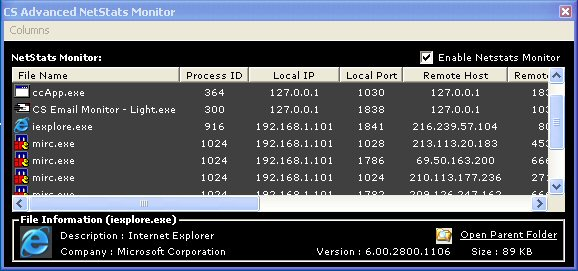



## CS Advanced NetStats Monitor

### Description

Uses the xp AllocateAndGetTCPExTableFromStack to get the standard netstats in xp but also the Process ID of what each connection has, thus letting us find out which program is on the net. This program came from 2 different sources one from here by JayStacey , who in his version had some of my bandwidth code and just a few bugs in the code, not much though. The second came from a VB .Net example here http://www.codeproject.com/csharp/iphlpapi.asp?target=netstat

Nice program also uses the AllocateAndGetUdpExTableFromStack to get the UDP connections to. This program isnt perfect of course, nothing really is, and I dont get credit for the code, just cleaning it up. I did this example for I could learn of these new undocumented api calls for XP and 2003 (and hopefully furture versions.) I will be using this in a upcoming program of mine. Please enjoy the code and I hope you learn something, cause you wont find any documentation on it from Microsoft, as of yet anyways.
 
### More Info
 

             |
---                |---
**Submitted On**   |2004-04-12 01:01:02
**By**             |[Shane M Croft](https://github.com/Planet-Source-Code/PSCIndex/blob/master/ByAuthor/shane-m-croft.md)
**Level**          |Advanced
**User Rating**    |4.6 (41 globes from 9 users)
**Compatibility**  |VB 6\.0
**Category**       |[Complete Applications](https://github.com/Planet-Source-Code/PSCIndex/blob/master/ByCategory/complete-applications__1-27.md)
**World**          |[Visual Basic](https://github.com/Planet-Source-Code/PSCIndex/blob/master/ByWorld/visual-basic.md)
**Archive File**   |[CS\_Advance1732544122004\.zip](https://github.com/Planet-Source-Code/shane-m-croft-cs-advanced-netstats-monitor__1-53085/archive/master.zip)

